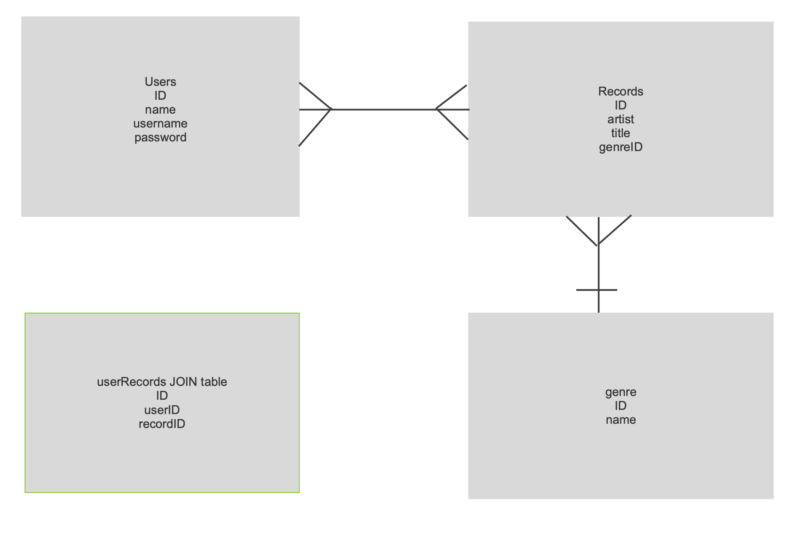

## Project 2: High-Fidelity (Hi-Fi)

This is a project to work on Model View Controllers and GitHub collaboration. We created an app to track record ownership.

### Current Features
* User Profile page
  * Welcoming the user
  * Shows name, username, and password
  * Add a record to the users collection
  * Edit user button
  * Delete user button
  * Shows the users collection
* Record index page
  * Create a new record
  * List record by title and artist
  * Edit record link
  * Delete record button

### Planned Features
* Button to remove owned record
* Add record genre table
* CSS styling
* Encrypt passwords
* Ability to add multiple records at a time

### Technology Used
* Utilizing MVC architecture
  * Routes
  * Controllers
  * Views
* SQL database
* JOIN tables
* Sequlize
* Express/EJS

#### Entity Relationship Diagram

[Here is the project repository]()
[Here is the published project]()